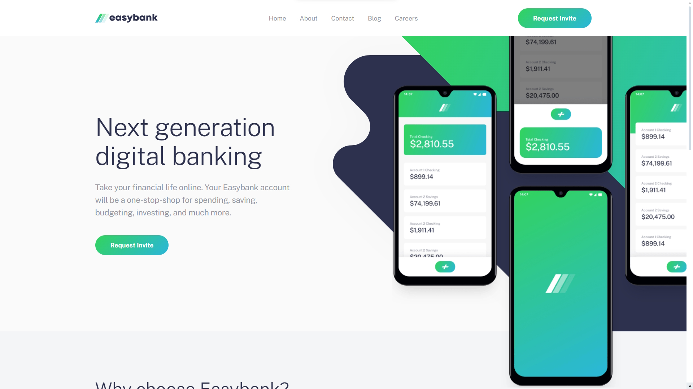
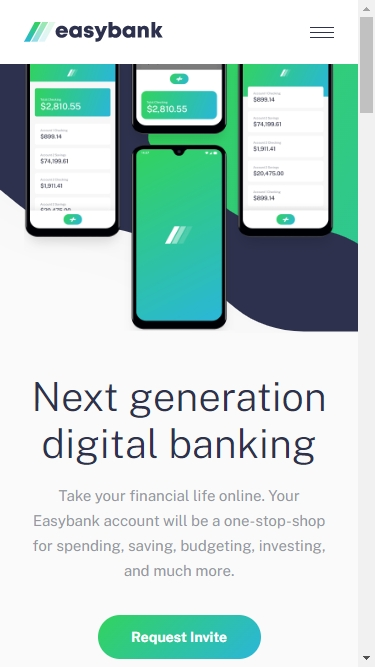

# Frontend Mentor - Easybank landing page solution

This is a solution to the [Easybank landing page challenge on Frontend Mentor](https://www.frontendmentor.io/challenges/easybank-landing-page-WaUhkoDN). Frontend Mentor challenges help you improve your coding skills by building realistic projects. 

## Table of contents

- [Overview](#overview)
  - [The challenge](#the-challenge)
  - [Screenshot](#screenshot)
  - [Links](#links)
- [My process](#my-process)
  - [Built with](#built-with)
  - [What I learned](#what-i-learned)
  - [Useful resources](#useful-resources)
- [Author](#author)

## Overview

### The challenge

Users should be able to:

- View the optimal layout for the site depending on their device's screen size
- See hover states for all interactive elements on the page

### Screenshot

### Links

- Solution URL: [Github](https://github.com/doganfurkan/easybank-landing-page-master)
- Live Site URL: [Live](https://doganfurkan.github.io/easybank-landing-page-master/)

## My process

### Built with

- Semantic HTML5 markup
- Flexbox
- Mobile-first workflow

### What I learned

In this challenge, I had figma files for the first time. Since I have the designs, I tried to make this website pixel-perfect.

### Useful resources

- [Filtering for svg images](https://codepen.io/sosuke/pen/Pjoqqp) - This helped me for social media icons. For their hover states, I used this website for the color change.

## Author

- Frontend Mentor - [@doganfurkan](https://www.frontendmentor.io/profile/doganfurkan)
- Github - [@doganfurkan](https://github.com/doganfurkan)